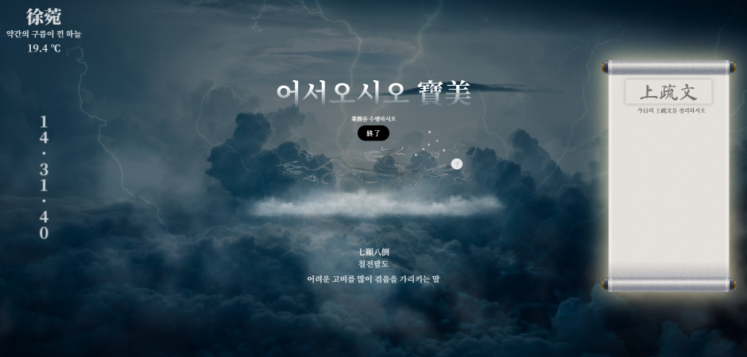

# 목차

- [프로젝트 소개](#프로젝트-소개)
- [사용된 기술 스택](#사용된-기술-스택)
  - [Front-End](#front-end)
- [구현한 기능 목록](#구현한-기능-목록)
- [외부 리소스 정보](#외부-리소스-정보)

 

# 프로젝트 소개

 
 

  노마드 코더의 바닐라 JS로 크롬 앱 만들기 Challenge로 시작한 프로젝트입니다.😎 
무언가 멋지고 재미있는 콘셉트로 Todo 리스트를 만들면 재밌지 않을까라는 생각에서 시작해 내가 <b>하늘의 임금, 天帝로서 업무를 수행</b>하는 느낌을 내봐야겠다고 시작한 프로젝트입니다. 
구름이 들어간 배경들을 고르고, 동양풍 콘셉트에 맞게 명언들은 한문 성어를 크롤링 하여 구현했습니다. 
오늘만큼은 당신이 제왕! 하늘을 관장하는 신이 되어 업무를 즐겨봅시다🌩️

 

# 사용된 기술 스택

## Front-End

 

# 구현한 기능 목록

- 새로고침을 할 때마다 랜덤한 다섯 개의 배경화면 중에서 하나를 출력
- 현재 지역의 날씨 좌표를 잡아 지역을 한문으로, 설명을 한국어로 변경 (단, 모든 도시의 한문 변경은 불가능하여 8도에 한해서 진행)
- 크롤링으로 가져온 한문 성어를 10초마다 랜덤하게 보여주기

 

# 외부 리소스 정보

<a href="https://portal.nrich.go.kr/kor/designUsrView.do?menuIdx=589&idx=2365" target="_blank">a blue dragon</a> : 이 저작물은 공공누리 제1유형에 따라 국립문화재연구원(<a href="https://portal.nrich.go.kr">https://portal.nrich.go.kr</a>), 작성자 : 미술문화재연구실의 공공저작물을 이용하였습니다. 
<a href="https://pixabay.com/images/id-5398664/" target="_blank">thunder background</a> 
<a href="https://pixabay.com/images/id-3652193/" target="_blank">lightning background</a> 
<a href="https://pixabay.com/images/id-1836972/" target="_blank">dark background</a> 
<a href="https://pixabay.com/images/id-1835427/" target="_blank">dark clouds background</a> 
<a href="https://kor.pngtree.com/freepng/reel_575413.html" target="_blank">두루마리</a> 
<a href="https://fontawesome.com/icons/d-and-d?s=&f=brands" target="_blank">dragon button</a>
